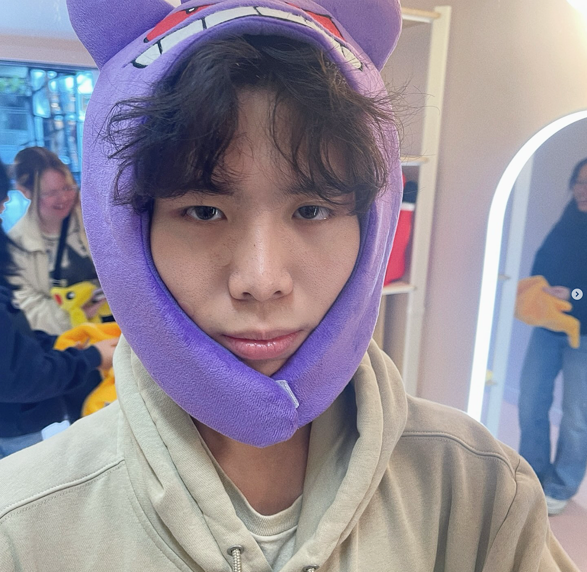

# Harvey

## About Me
Hi, I'm Harvey and I am a student in UCSD studying *computer engineering*.
As a programmer, I enjoy building mini projects through coding. My favorite 
programming language is **C++** because I've been using it a lot for other classes.
Outside of programming, I enjoy playing basketball with friends and watching anime.

## Picture


## Goals 
1. Get a software engineering job
2. Buy a house
3. Develop my own app

## Hobbies
- Basketball
- Gaming
- Coding
   
## Quote
> It always seems impossible until it's done. - Nelson Mandela

## Code Example
```cpp
#include <iostream>
using namespace std;

int main() {
    cout << "Hello, GitHub Pages!" << endl;
    return 0;
}
```

## External Link
[Visit GitHub](https://github.com/lurany)

[Goals](#goals)

[README](README.md)

## Tasks
- [x] Create index.md
- [x] Add a picture
- [ ] Publish GitHub Pages
